# Placement OS

A comprehensive placement management system built with React, Vite, Tailwind CSS, and Supabase.

## 📊 System Architecture

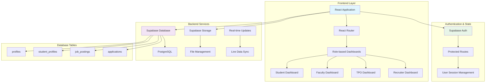

## 🔄 User Authentication Flow

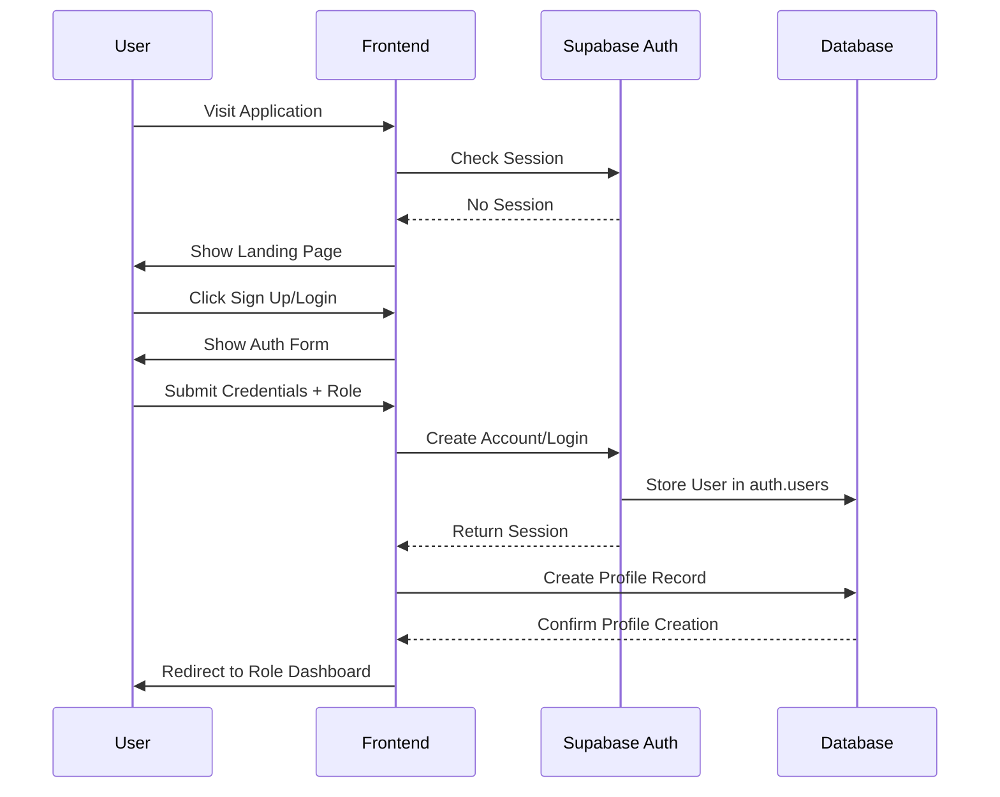

## 🎯 Role-Based Dashboard Flow

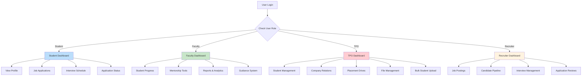

## 🏗️ Database Entity Relationship

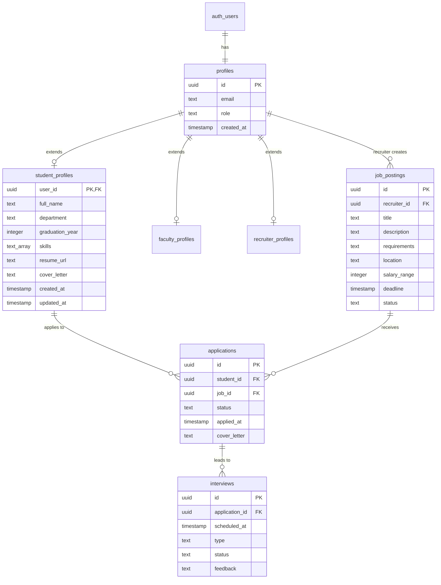

## 🔄 Student Management Workflow (TPO Dashboard)

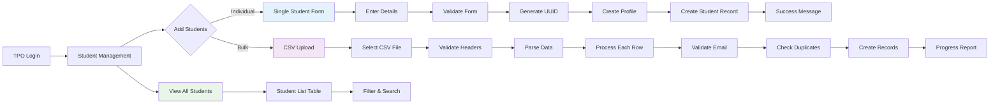

## 📁 File Upload Process

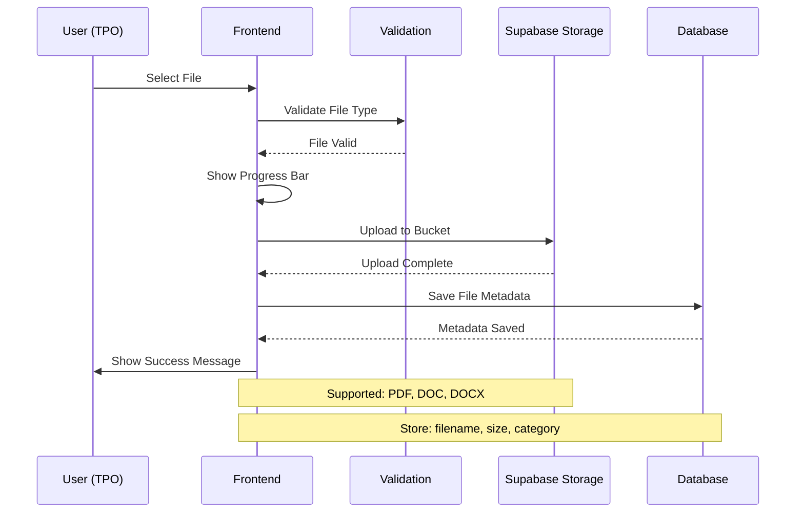

## ⚡ Real-time Data Flow

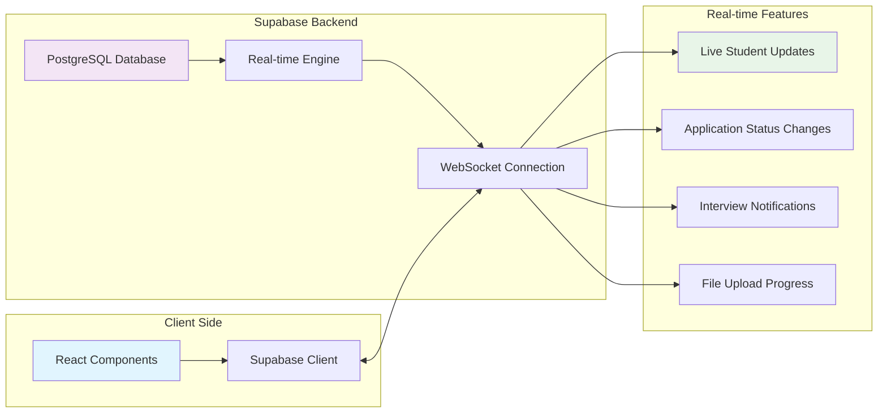

## 🔐 Security & Access Control

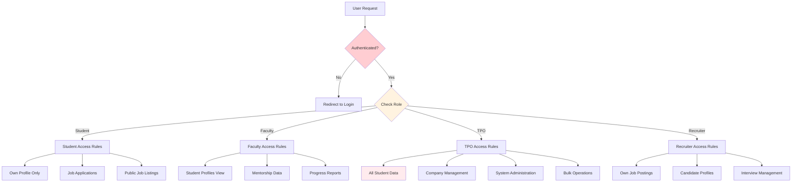

## Features
  - Students: Apply for jobs and track appl## 🚀 Deployment Architecture

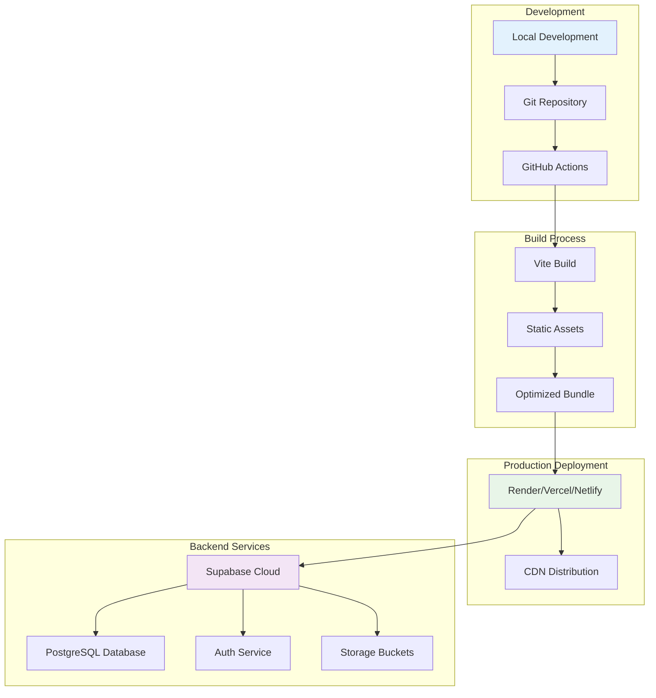

## 🔄 Application Lifecycle

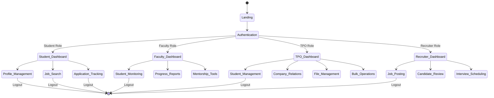

- **Multi-Role Authentication**: Support for 4 user types:

## 📊 TPO Dashboard Feature Map

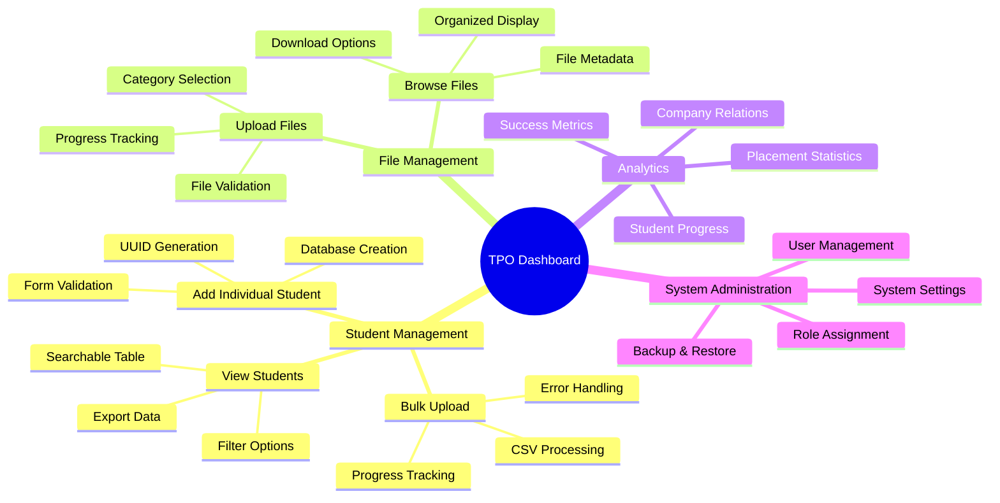

## 🔧 Technical Implementation Flow

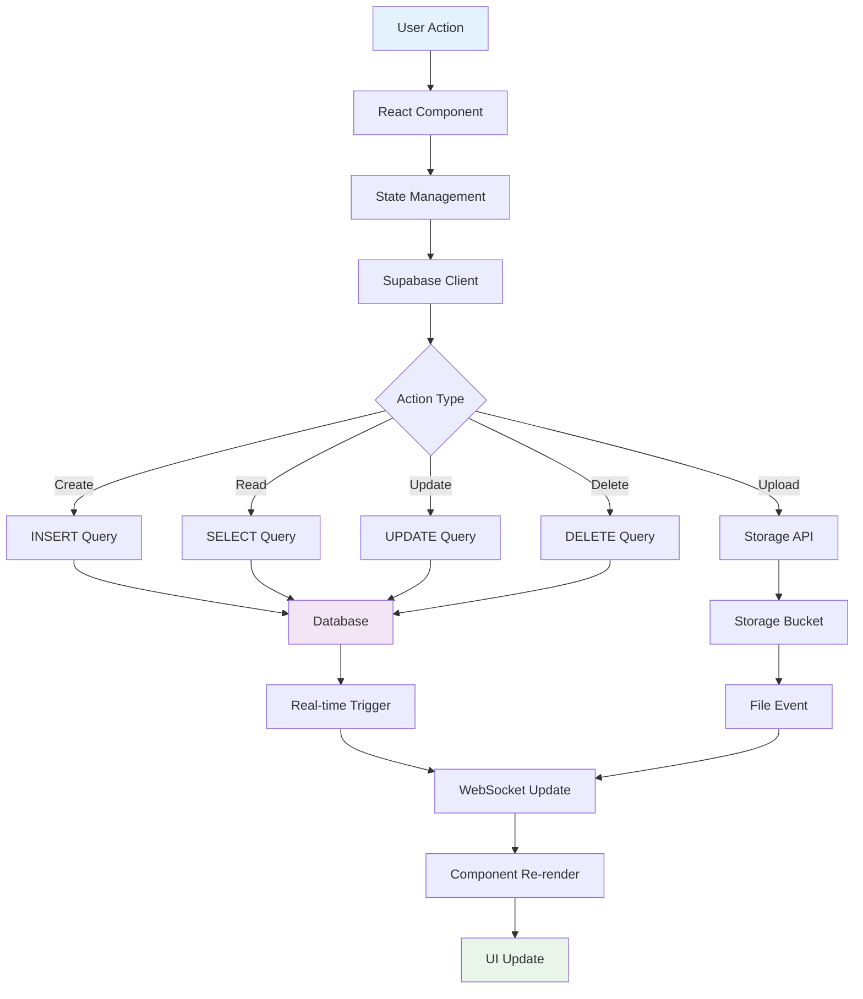

### Database Schema
- `id` (uuid, primary key, foreign key to auth.users.id)
- `email` (text, user's email address)
- `role` (text, one of: Student, Faculty, TPO, Recruiter)

#### student_profiles table
- `user_id` (uuid, primary key, foreign key to profiles.id)
- `full_name` (text, student's full name)
- `department` (text, academic department)
- `graduation_year` (integer, year of graduation)
- `skills` (text[], array of skills)
- `resume_url` (text, URL to uploaded resume)
- `cover_letter` (text, personal statement/cover letter)
- `created_at` (timestamp, record creation time)
- `updated_at` (timestamp, last update time)

#### Storage Buckets
- `resumes` - Public bucket for storing student resume filesns
  - Faculty: Monitor student progress and provide guidance
  - TPO (Placement Cell): Coordinate placements and manage the process
  - Recruiters: Post jobs and find candidates

- **Role-Based Dashboards**: Unique dashboard layouts for each role:
  - Student Dashboard: Profile management, job applications, interview tracking
  - Faculty Dashboard: Student progress monitoring, guidance tools
  - TPO Dashboard: Comprehensive placement management and coordination
  - Recruiter Dashboard: Job posting, candidate management, interview scheduling

- **Student Profile Management**: Complete profile system with:
  - Personal information (name, department, graduation year)
  - Skills management with tag-based interface
  - Resume upload with Supabase Storage integration
  - Cover letter and personal statement
  - Real-time profile strength indicator

- **Secure Authentication**: Powered by Supabase Auth
- **File Upload**: Resume storage with Supabase Storage
- **Responsive Design**: Built with Tailwind CSS
- **Protected Routes**: Role-based access control
- **Real-time Data**: Supabase real-time database integration

## Prerequisites

- Node.js (v16 or higher)
- npm or yarn
- Supabase account

## Setup Instructions

### 1. Clone the Repository

```bash
git clone <repository-url>
cd placement-os
```

### 2. Install Dependencies

```bash
npm install
```

### 3. Supabase Setup

1. Create a new project at [supabase.com](https://supabase.com)
2. Go to Settings > API to get your Project URL and anon key
3. In the Supabase Table Editor, create the required tables:

#### Profiles Table
```sql
CREATE TABLE profiles (
  id UUID REFERENCES auth.users(id) PRIMARY KEY,
  email TEXT NOT NULL,
  role TEXT NOT NULL CHECK (role IN ('Student', 'Faculty', 'TPO', 'Recruiter'))
);

-- Enable Row Level Security
ALTER TABLE profiles ENABLE ROW LEVEL SECURITY;

-- Create policies
CREATE POLICY "Users can view their own profile" ON profiles
  FOR SELECT USING (auth.uid() = id);

CREATE POLICY "Users can update their own profile" ON profiles
  FOR UPDATE USING (auth.uid() = id);

CREATE POLICY "Users can insert their own profile" ON profiles
  FOR INSERT WITH CHECK (auth.uid() = id);
```

#### Student Profiles Table
```sql
CREATE TABLE student_profiles (
  user_id UUID REFERENCES profiles(id) PRIMARY KEY,
  full_name TEXT,
  department TEXT,
  graduation_year INTEGER,
  skills TEXT[],
  resume_url TEXT,
  cover_letter TEXT,
  created_at TIMESTAMP WITH TIME ZONE DEFAULT NOW(),
  updated_at TIMESTAMP WITH TIME ZONE DEFAULT NOW()
);

-- Enable Row Level Security and create policies
ALTER TABLE student_profiles ENABLE ROW LEVEL SECURITY;

CREATE POLICY "Students can manage their own profile" ON student_profiles
  FOR ALL USING (auth.uid() = user_id);

CREATE POLICY "Faculty and TPO can view student profiles" ON student_profiles
  FOR SELECT USING (
    EXISTS (
      SELECT 1 FROM profiles 
      WHERE profiles.id = auth.uid() 
      AND profiles.role IN ('Faculty', 'TPO')
    )
  );
```

#### Storage Bucket Setup
1. Go to Storage in your Supabase dashboard
2. Create a new bucket named `resumes`
3. Set it as a public bucket
4. Configure storage policies for file access

For detailed database setup instructions, see `SUPABASE_SETUP.md`.

### 4. Environment Configuration

1. Copy `.env.example` to `.env`:
   ```bash
   cp .env.example .env
   ```

2. Update the `.env` file with your Supabase credentials:
   ```
   VITE_SUPABASE_URL=your_supabase_project_url
   VITE_SUPABASE_ANON_KEY=your_supabase_anon_key
   ```

### 5. Run the Application

```bash
npm run dev
```

The application will be available at `http://localhost:3000`

## Project Structure

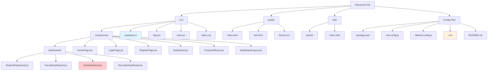

```
src/
├── components/
│   ├── dashboards/
│   │   ├── StudentDashboard.jsx    # Student portal with profile management
│   │   ├── FacultyDashboard.jsx    # Faculty monitoring tools
│   │   ├── TpoDashboard.jsx        # TPO coordination interface
│   │   └── RecruiterDashboard.jsx  # Recruiter management portal
│   ├── DashboardLayout.jsx         # Shared dashboard layout
│   ├── HomePage.jsx                # Landing page
│   ├── LoginPage.jsx               # User login
│   ├── RegisterPage.jsx            # User registration with role selection
│   ├── Dashboard.jsx               # Main dashboard router
│   └── ProtectedRoute.jsx          # Route protection component
├── supabase.js                     # Supabase client configuration
├── App.jsx                         # Main app component with routing
├── main.jsx                        # App entry point
└── index.css                       # Global styles with Tailwind
```

## 📋 Feature Matrix by Role

```mermaid
%%{init: {"theme": "base", "themeVariables": {"primaryColor": "#ff0000"}}}%%
gitgraph
    commit id: "Project Init"
    branch student-features
    checkout student-features
    commit id: "Profile Management"
    commit id: "Job Applications"
    commit id: "Interview Tracking"
    
    checkout main
    branch faculty-features
    checkout faculty-features
    commit id: "Student Monitoring"
    commit id: "Progress Reports"
    commit id: "Mentorship Tools"
    
    checkout main
    branch tpo-features
    checkout tpo-features
    commit id: "Student Management"
    commit id: "Bulk Upload System"
    commit id: "File Management"
    commit id: "Company Relations"
    
    checkout main
    branch recruiter-features
    checkout recruiter-features
    commit id: "Job Posting"
    commit id: "Candidate Pipeline"
    commit id: "Interview Scheduling"
    
    checkout main
    merge student-features
    merge faculty-features
    merge tpo-features
    merge recruiter-features
    commit id: "Production Release"
```

## 🎯 User Journey Mapping

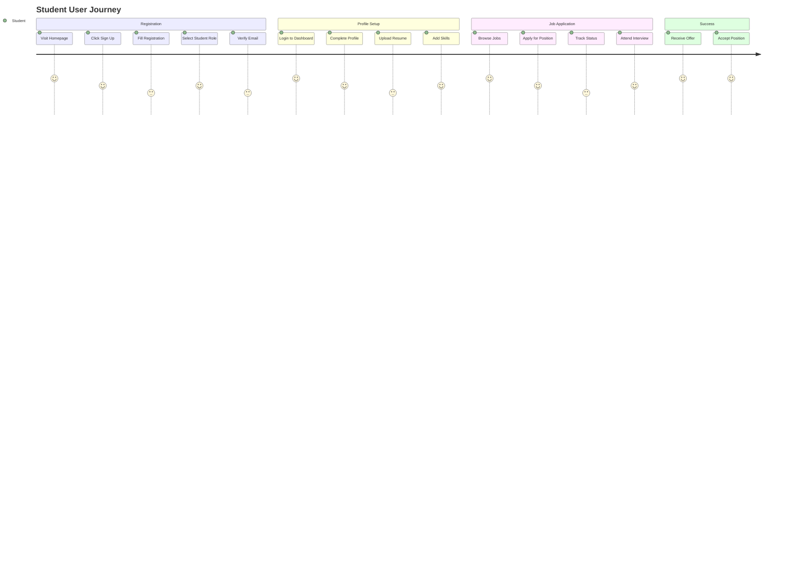

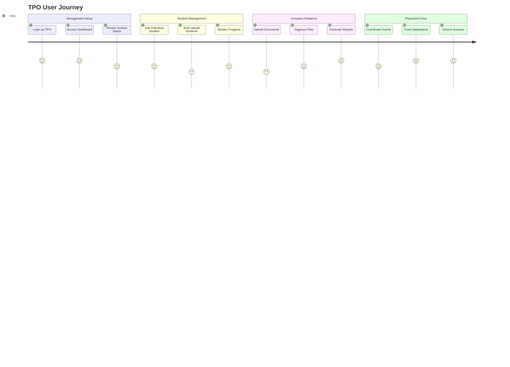

## User Roles & Features

### Student
- View and apply for job openings
- Track application status
- Manage personal profile
- Schedule and view interviews

### Faculty
- Monitor student progress
- View placement statistics
- Generate reports
- Provide guidance to students

### TPO (Training & Placement Officer)
- Manage company relationships
- Coordinate placement drives
- Oversee entire placement process
- Generate comprehensive reports

### Recruiter
- Post job openings
- Review student applications
- Schedule interviews
- Manage candidate pipeline

## Testing the Authentication System

### Checkpoint Verification:

#### From Prompt 1:
1. **User Registration**: 
   - Navigate to `/register`
   - Fill in email, password, and select a role
   - Submit the form
   - Check Supabase Auth dashboard for new user in `auth.users`
   - Check `profiles` table for corresponding profile record

2. **User Login**:
   - Navigate to `/login`
   - Use registered credentials to sign in
   - Verify redirection to appropriate role-based dashboard

3. **Role-based Dashboard**:
   - Confirm dashboard shows role-specific content and layout
   - Verify user profile information displays correctly

#### From Prompt 2:
1. **Role-Specific Dashboards**:
   - Login with different roles (Student, Faculty, TPO, Recruiter)
   - Verify each role sees a unique dashboard layout with proper sidebar navigation
   - Confirm role-appropriate features and content are displayed

2. **Student Profile Management**:
   - Login as a Student
   - Navigate to Profile section in the dashboard
   - Fill out personal information (name, department, graduation year)
   - Add skills using the tag-based interface
   - Upload a resume file (PDF, DOC, or DOCX)
   - Add a cover letter/personal statement
   - Submit the form

3. **Data Persistence**:
   - Check `student_profiles` table in Supabase for new/updated record
   - Verify resume file appears in `resumes` storage bucket
   - Confirm all form data is correctly saved and retrievable
   - Test profile strength indicator updates based on completion

4. **File Upload Functionality**:
   - Verify resume upload progress indicator
   - Check file size and format validation
   - Confirm "View Current Resume" link works after upload
   - Test file replacement functionality

## Database Schema

### profiles table
- `id` (uuid, primary key, foreign key to auth.users.id)
- `email` (text, user's email address)
- `role` (text, one of: Student, Faculty, TPO, Recruiter)

## Development Commands

- `npm run dev` - Start development server
- `npm run build` - Build for production
- `npm run preview` - Preview production build
- `npm run lint` - Run ESLint

## 🔧 Development Workflow

```mermaid
gitgraph
    commit id: "Initial Setup"
    commit id: "Auth System"
    branch feature-student-dashboard
    checkout feature-student-dashboard
    commit id: "Student Profile"
    commit id: "Resume Upload"
    checkout main
    merge feature-student-dashboard
    branch feature-tpo-dashboard
    checkout feature-tpo-dashboard
    commit id: "Student Management"
    commit id: "Bulk Upload"
    commit id: "File Management"
    commit id: "UUID Fixes"
    checkout main
    merge feature-tpo-dashboard
    commit id: "Production Ready"
    commit id: "GitHub Deploy"
```

## 🌟 System Capabilities Overview

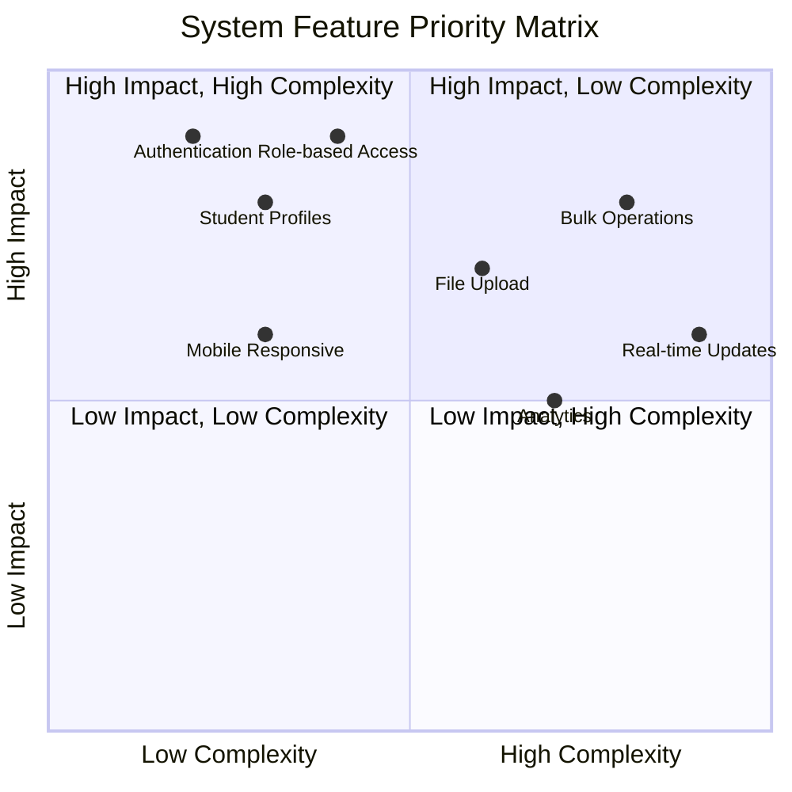

## Technologies Used

- **Frontend**: React 18, Vite, Tailwind CSS
- **Backend**: Supabase (Auth, Database, Real-time)
- **Routing**: React Router v6
- **Styling**: Tailwind CSS
- **Build Tool**: Vite

## Next Steps

After completing this foundation, you can extend the application with:
- Role-specific features and workflows
- Job posting and application management
- Interview scheduling system
- Notification system
- File upload capabilities
- Advanced reporting and analytics

## Troubleshooting

1. **Authentication errors**: Verify Supabase URL and keys in `.env`
2. **Database errors**: Ensure `profiles` table exists with correct schema
3. **Build errors**: Check that all dependencies are installed
4. **Routing issues**: Verify React Router is properly configured

## Support

For issues and questions, please check the documentation or create an issue in the project repository.